# Customer Inquiry Automation

An end-to-end MVP for receiving customer inquiries, analysing them with Gemini, and presenting structured results and reply drafts for human review.

The solution is split into two repositories. This same README is included in both so either repository contains the complete setup and demonstration guide.

- **Backend:** [RometPajanin/ClientAutomation](https://github.com/RometPajanin/ClientAutomation)
- **Frontend:** [RometPajanin/ClientAutomationClient](https://github.com/RometPajanin/ClientAutomationClient)

> **Demo only:** use synthetic data. Do not submit real names, contact details, passwords, customer messages, or confidential information. Inquiry fields are stored as plaintext and their content may be sent to the configured AI provider.

## What the application does

- Accepts a customer inquiry through a validated public form
- Stores the original inquiry in PostgreSQL
- Detects repeated submissions and recent duplicate inquiries
- Uses Gemini to categorise and prioritise the inquiry
- Extracts structured information such as contact details, requested service, deadline, and budget
- Identifies missing information and risk flags
- Generates an optional reply draft
- Keeps all AI output subject to human review and never sends replies automatically
- Provides an authenticated admin inbox with search and filters
- Allows an administrator to update the company-context prompt used for future analyses

## Application flow

```mermaid
flowchart LR
    A[Customer submits form] --> B[Frontend validation]
    B --> C[Backend validation and normalisation]
    C --> D[Replay and duplicate checks]
    D --> E[(PostgreSQL)]
    E --> F[202 Accepted]
    F --> G[Asynchronous Gemini analysis]
    G --> H[Schema validation and result storage]
    H --> I[Admin inbox]
    I --> J[Human reviews result and reply draft]
```



The backend first stores the inquiry and returns `202 Accepted`. A same-process analysis runner then claims the record, sends it to the configured AI provider, validates the structured response with Zod, and stores the result. Duplicate inquiries are handled without starting another AI analysis.

## Technology

| Area | Technology |
| --- | --- |
| Frontend | Vue 3, Vite, Fetch API, plain CSS |
| Backend | Node.js 24, TypeScript, Fastify, Zod |
| Database | PostgreSQL 17, Prisma |
| AI | Google Gemini through `@google/genai` |
| Local infrastructure | Docker Compose |
| Backend tests | Vitest |

## Repository responsibilities

### Backend

The [backend repository](https://github.com/RometPajanin/ClientAutomation) owns:

- Public and admin API endpoints
- Input validation and duplicate detection
- Gemini integration and structured output validation
- PostgreSQL persistence and Prisma migrations
- Admin sessions, signed HttpOnly cookies, and CSRF protection
- Rate limiting, security headers, audit events, health checks, and Swagger documentation

### Frontend

The [frontend repository](https://github.com/RometPajanin/ClientAutomationClient) owns:

- Public inquiry form and client-side validation
- Demo-data warning and consent control
- Admin login and session restoration
- Searchable and filterable inquiry inbox
- Inquiry details, AI summary, priority, confidence, and reply draft
- Company-context prompt settings
- Browser API client and CSRF-token handling

## Prerequisites

Install the following before starting:

- Node.js 24.x and npm
- Docker Desktop, or another Docker installation with Compose
- Git
- A Gemini API key for live AI analysis

Docker runs only PostgreSQL. The frontend and backend run directly in Node.js for a short development feedback loop.

## Clone both repositories

Place both repositories next to each other:

```powershell
git clone https://github.com/RometPajanin/ClientAutomation.git
git clone https://github.com/RometPajanin/ClientAutomationClient.git
```

The commands below assume these default directory names.

## Get a Gemini API key

1. Open the [Google AI Studio API Keys page](https://aistudio.google.com/app/apikey) and sign in with a Google account.
2. Accept the required terms if prompted.
3. Select **Create API key** and choose or create a Google Cloud project.
4. Copy the generated key.
5. Add it only to the backend `.env` file:

   ```env
   GEMINI_API_KEY=your_api_key_here
   ```

6. Optionally verify the connection after installing the backend dependencies:

   ```powershell
   cd ClientAutomation
   npm run ai:smoke
   ```

Google's current instructions are available in the [official Gemini API key documentation](https://ai.google.dev/gemini-api/docs/api-key).

Never put the key in the frontend, expose it through a `VITE_` variable, commit the backend `.env` file, or include it in screenshots. Revoke and replace the key in Google AI Studio if it is exposed.

## Start locally

Use two terminals after completing the one-time setup.

### 1. Start the backend and database

```powershell
cd ClientAutomation
Copy-Item .env.example .env
npm install
npm run db:start
npm run db:deploy
npm run dev
```

Before `npm run dev`, open `.env` and add the Gemini key if live analysis is required.

On macOS or Linux, replace `Copy-Item .env.example .env` with:

```bash
cp .env.example .env
```

`npm run db:start` pulls `postgres:17-alpine` when needed, creates a persistent named volume, exposes PostgreSQL on `127.0.0.1:5433`, and waits for the database health check. `npm run db:stop` stops the container without deleting the stored data.

Backend URLs:

- API: [http://localhost:3000](http://localhost:3000)
- Swagger UI: [http://localhost:3000/documentation](http://localhost:3000/documentation)
- OpenAPI JSON: [http://localhost:3000/documentation/json](http://localhost:3000/documentation/json)
- Liveness check: [http://localhost:3000/health/live](http://localhost:3000/health/live)
- Database readiness: [http://localhost:3000/health/ready](http://localhost:3000/health/ready)

Without `GEMINI_API_KEY`, the API can still accept and store inquiries, but live AI analysis is disabled.

### 2. Start the frontend

In a second terminal:

```powershell
cd ClientAutomationClient
Copy-Item .env.example .env
npm install
npm run dev
```

On macOS or Linux:

```bash
cp .env.example .env
```

Open the URL shown by Vite, normally [http://localhost:5173](http://localhost:5173).

The frontend environment file points to the local backend:

```env
VITE_API_BASE_URL=http://localhost:3000
```

The backend must allow the frontend origin:

```env
CORS_ALLOWED_ORIGINS=http://localhost:5173
```

Restart the relevant development server after changing either `.env` file.

## Demo walkthrough

1. Open [http://localhost:5173](http://localhost:5173).
2. Submit a synthetic inquiry using a contact such as `alex@example.com`.
3. Select **Admin Access**.
4. Sign in with:
   - Username: `admin`
   - Password: `demo-admin-password`
5. Open **Inbox** and refresh if the analysis is still processing.
6. Select **View** to inspect the original inquiry and AI result.
7. Open **Settings** to change the company-context prompt for future analyses.
8. Submit the same inquiry again to demonstrate duplicate handling.

When no admin session exists, the initial `GET /api/v1/auth/session` request returns `401 Unauthorized`. This is expected. The frontend treats it as a signed-out state and continues to display the public page.

## Changing the AI model or provider

The Gemini model is selected in the backend `.env` file and can be changed without editing source code:

```env
GEMINI_MODEL=gemini-3.1-flash-lite
```

Provider-specific code is isolated in the backend's `gemini.provider.ts`. The analysis workflow depends on an `AnalysisProvider` interface. To use another AI vendor:

1. Implement the `AnalysisProvider` interface in a new adapter.
2. Return values that satisfy the local `AnalysisOutput` schema.
3. Select the adapter in `analysis.factory.ts`.

The company-context prompt is configured separately through the admin settings screen or API. Every update creates an immutable prompt version, and each analysis records which version it used.

## API endpoints

| Method | Path | Access | Purpose |
| --- | --- | --- | --- |
| `GET` | `/health/live` | Public | Process liveness |
| `GET` | `/health/ready` | Public | PostgreSQL readiness |
| `GET` | `/health` | Public | Readiness alias |
| `POST` | `/api/v1/inquiries` | Public, rate-limited | Submit an inquiry |
| `POST` | `/api/v1/auth/login` | Public, rate-limited | Create an admin session |
| `GET` | `/api/v1/auth/session` | Session cookie | Restore a session and CSRF token |
| `POST` | `/api/v1/auth/logout` | Session + CSRF | Revoke the session |
| `GET` | `/api/v1/admin/inquiries` | Session cookie | List, search, filter, and sort inquiries |
| `GET` | `/api/v1/admin/inquiries/:id` | Session cookie | Read inquiry, analysis, duplicate, and audit details |
| `GET` | `/api/v1/admin/settings/ai` | Session cookie | Read the active company prompt |
| `PUT` | `/api/v1/admin/settings/ai` | Session + CSRF | Create and activate a prompt version |

Swagger documents the request and response schemas and all supported query parameters.

## Useful commands

### Backend

Run these from `ClientAutomation`:

| Command | Purpose |
| --- | --- |
| `npm run dev` | Start the TypeScript server with reload |
| `npm run build` | Compile the production server |
| `npm start` | Run the compiled server |
| `npm run check` | Type-check, test, and build |
| `npm test` | Run the Vitest test suite |
| `npm run db:start` | Start PostgreSQL and wait until healthy |
| `npm run db:status` | Show the database container status |
| `npm run db:stop` | Stop PostgreSQL without deleting its volume |
| `npm run db:deploy` | Apply committed Prisma migrations |
| `npm run db:migrate -- --name <name>` | Create a development migration |
| `npm run db:studio` | Open Prisma Studio, normally on port 5555 |
| `npm run ai:smoke` | Make one real Gemini request |

### Frontend

Run these from `ClientAutomationClient`:

| Command | Purpose |
| --- | --- |
| `npm run dev` | Start the Vite development server |
| `npm run build` | Create a production bundle in `dist/` |
| `npm run preview` | Serve the production bundle locally |

## Project structure

```text
ClientAutomation/
├── prisma/                  # Database schema and committed migrations
├── scripts/                 # Gemini smoke test
├── src/
│   ├── config/              # Validated environment configuration
│   ├── modules/
│   │   ├── admin/           # Inquiry admin read models
│   │   ├── analysis/        # AI interface, Gemini adapter, schema, workflow
│   │   ├── auth/            # Login, sessions, cookies, CSRF
│   │   ├── health/          # Liveness and readiness
│   │   ├── inquiries/       # Intake, normalisation, duplicate detection
│   │   └── settings/        # Versioned company prompt
│   ├── plugins/             # Database, security, Swagger, errors
│   ├── app.ts               # Composition root
│   └── server.ts            # Process startup and shutdown
└── tests/                   # Backend tests

ClientAutomationClient/
├── src/
│   ├── App.vue              # Screens, state, validation, interactions
│   ├── api.js               # API client and CSRF-token handling
│   ├── main.js              # Vue bootstrap
│   └── styles.css           # Interface styles
├── .env.example             # Public frontend configuration
├── index.html
└── vite.config.js
```

Routes handle HTTP concerns, backend services hold application rules, repositories own Prisma queries, and `src/app.ts` selects concrete dependencies at the application's composition root. Frontend API communication is isolated in `src/api.js`.

## Authentication and safety

- Admin authentication uses a revocable, signed, HttpOnly cookie.
- The password and session token are not stored in browser storage.
- State-changing admin requests require the backend-issued CSRF token.
- The browser includes cookies through `credentials: 'include'`.
- The CSRF token remains in memory and is cleared on logout.
- Public intake and login endpoints are rate-limited.
- Security headers are applied by the backend.
- AI output is schema-validated and never triggers automatic email sending.
- The committed admin account and session secret are demo values and must be replaced outside this local demonstration.

## Verification

Backend:

```powershell
cd ClientAutomation
npm run check
```

Frontend:

```powershell
cd ClientAutomationClient
npm run build
```